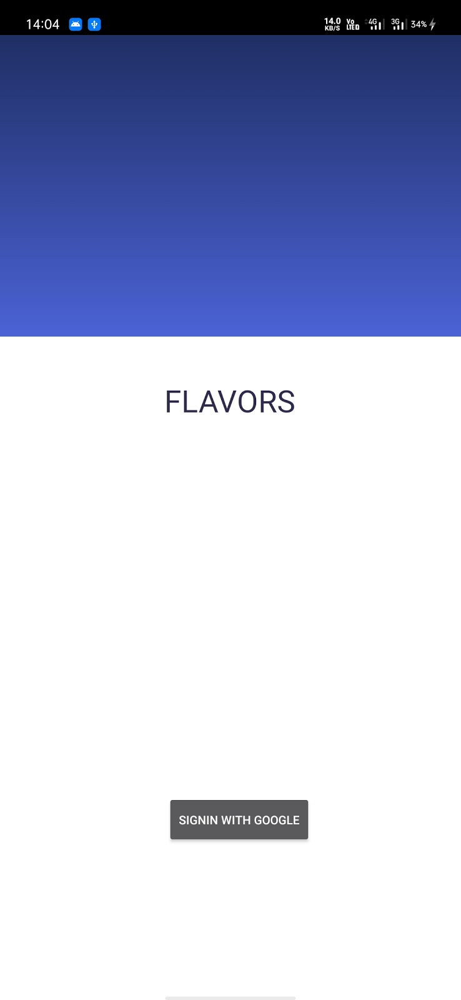
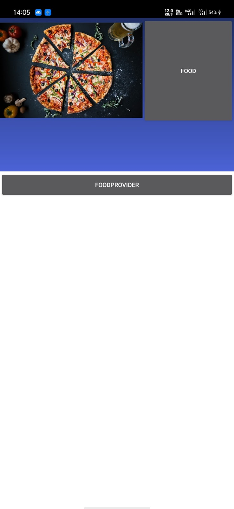
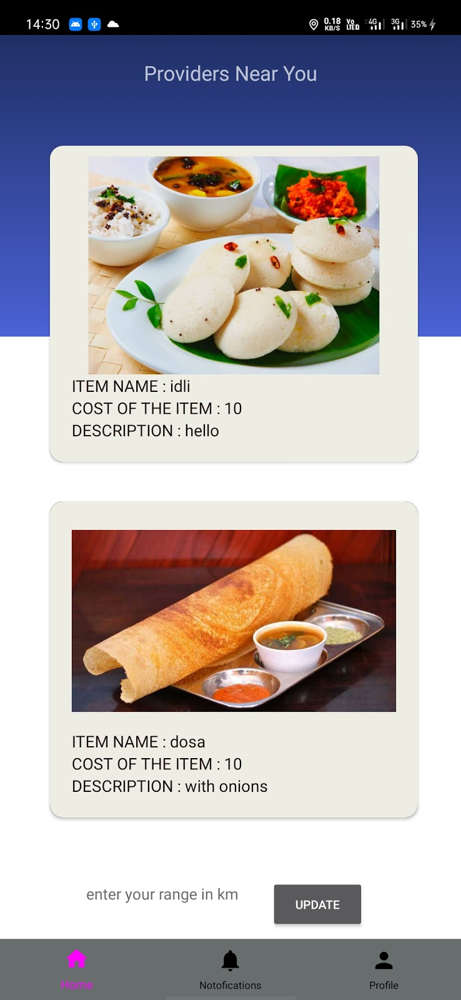
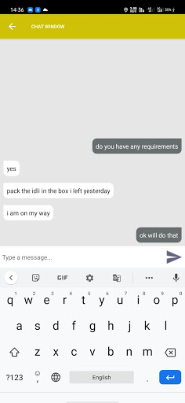
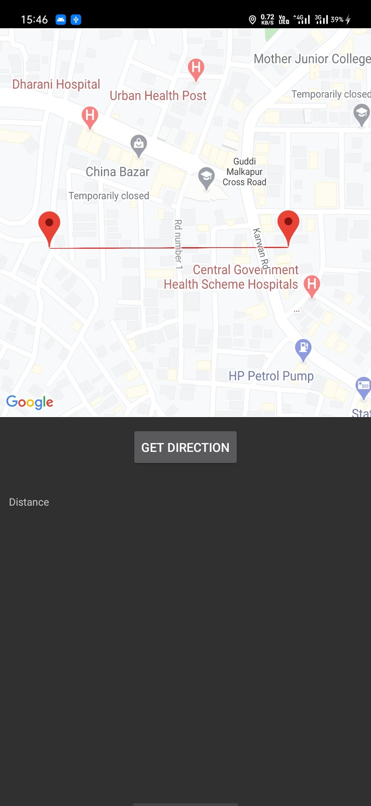

# flavOURS

An android application for home-food ordering. The main motive of the application is to provide tourists, bachelors, etc. a taste of local cuisines at comfortable price and provide a source of income to the locals.

#### Features

* Client and Provider functionality in a single app
* Client can choose the range (radius in km) to search for food providers
* Includes chat functionality for direct communication
* Provider can set his desired window time for accepting orders
* Notification equipped to send the status of the order,delivery,preparation and chat
* Google Maps support to reach the provider
* No Delivery

## Download

* [flavours_v1.0](https://drive.google.com/open?id=1aBkkqhsYQjZrmvbECE0g8j5HJ8evyJEP)

## Getting Started

These instructions will get you a copy of the project up and running on your local machine for development and testing purposes.

### Prerequisites

What things you need to install the software and how to install them


* Android Studio [android-studio](https://developer.android.com/studio/install) - Download for Linux/Windows
* Firebase [firebase](https://firebase.google.com/) - Create a project in the firebase


### Installing


1. Add the project to your firebase account
2. Download the ```google-services.json``` file and place it in the app-level directory of the project.
3. Add the necessary APIs (i.e. [Google-Maps-API](https://console.cloud.google.com/google/maps-apis/overview),[FCM Server key](https://firebase.google.com/))
4. Build and run

               

        

## Additional Dependencies used

* [Retrofit](https://square.github.io/retrofit/) - To send JSON object to FCM for notifications.


## Contributors

* [JVK Karthik](https://github.com/KARTHIKJVK)
* [Poreddy Premchandar Reddy]

## License

This project is licensed under the MIT License - see the [LICENSE.md](https://github.com/aniruddh-9/flavours/blob/master/LICENSE) file for details
